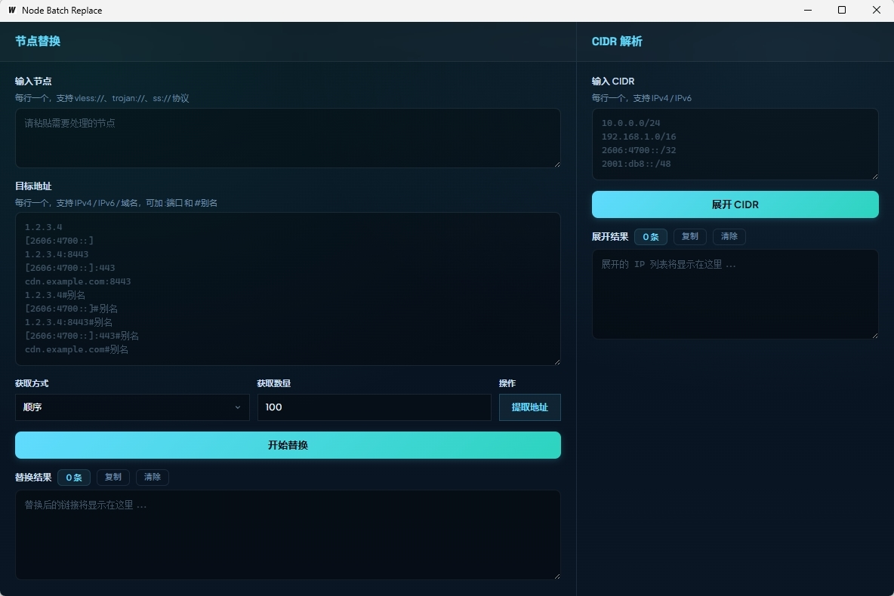

# Node Batch Replace — 节点批量替换工具

</img>

一款节点批量替换工具，目前支持 **vless / trojan / Shadowsocks（ss）** 协议

## 实现功能

- **节点替换**：将原始节点链接中的 IP/域名 批量替换为目标地址，支持 `vless://`、`trojan://`、`ss://` 三种协议
- **目标地址支持**：
  - IPv4 / IPv6 / 域名 / IPv4:PORT / IPV6:PORT / IPV4:PORT#别名 / IPV6:PORT#别名
- **获取方式**：支持**顺序**取前 N 个 或 **随机**取 N 个
- **提取地址**：自动从原始节点中提取 IP/域名
- **CIDR解析支持**：
  - IPV4 / IPV6

## 许可证

详见 [LICENSE](LICENSE)

## 致谢

[LINUXDO](https://linux.do)
